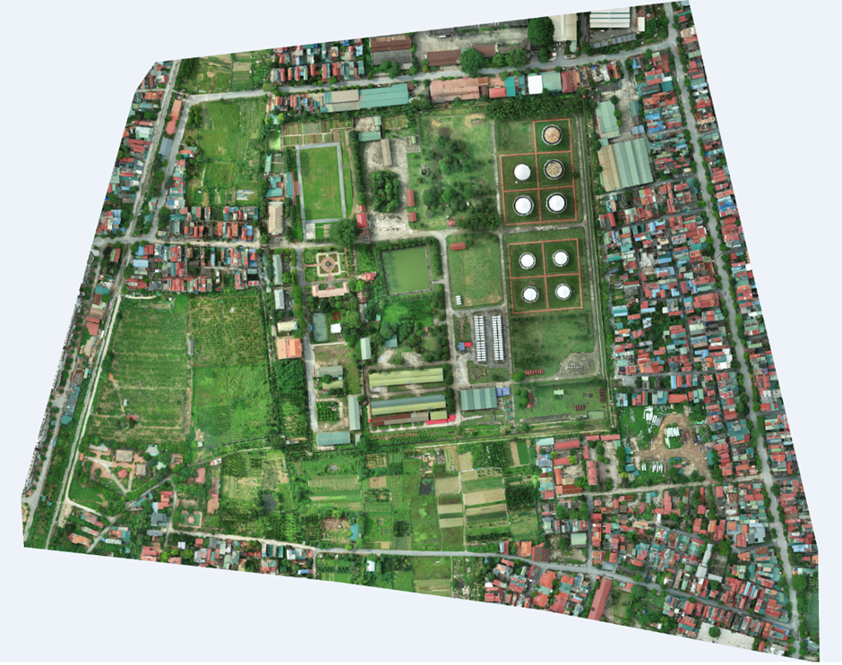

In this project, I present to you both machine learning and deep learning approaches to semantic segmentation of high resolution aerial images.
 For machine learning, I use Random Forest, XGBoost and Support Vector Machine(SVM) with the help of pretrained VGG-16 model to extract features from images.
For deep learning, I choose basic U-net model for the task and use transfer learning method on U-net with pretrained VGG-16 model in expectation of getting better result.
<br/>
<br/>
This is the image that I used to prepare dataset to train model and segmented at the end of each notebook: 



To run the project, you need to download all packages with this command
```pip install -r requirements.txt```
